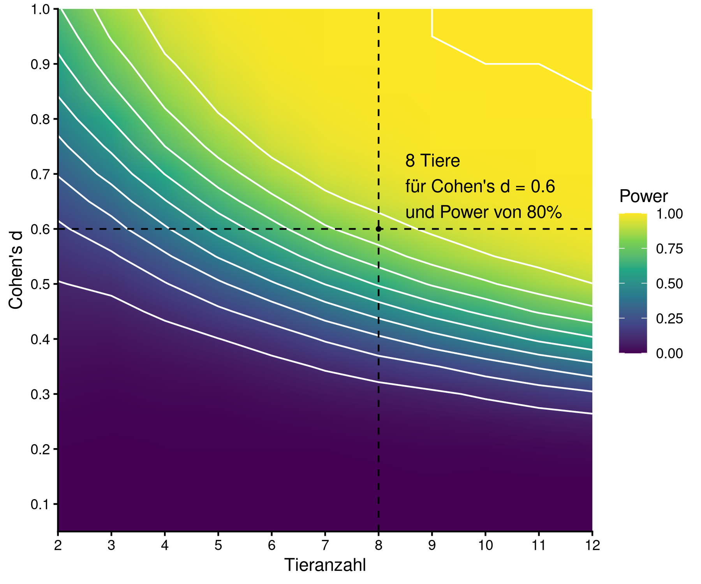

```{r setup, include=FALSE}
knitr::opts_chunk$set(echo = TRUE)
library(ggplot2)
library(data.table)
```

The following packages are required for the power analysis and visualisation.

```{r required_packages, include=TRUE, eval=FALSE}
library(data.table)
library(ggplot2)
library(betareg)
library(future.apply)
library(emmeans)
library(effectsize)
```

This is a computationally expensive simulation. If you have more than 80 cores the function will use 80. Should you have fewer cores detected it will use one core less than the maximum. The calculations will take time! This step checks if the function is run in RStudio. The faster multicore (not multisession) parallisation is not supported in RStudio.

```{r parallelization, include=TRUE, eval=FALSE}
n_cores <- ifelse(test = parallel::detectCores() > 80, yes = 80, no = parallel::detectCores() - 1)
if (Sys.getenv("RSTUDIO") == "1") {
  plan(multisession, workers = n_cores)
} else {
  plan(multicore, workers = n_cores)
}
```

Make results folder if not existing.

```{r create_results_folder, include=TRUE, eval=FALSE}
dir.create(path = "results")
```

Beta distribution based on Ling et al. 2025 derived from cell counts (mean=66.3%, sd=9.8%). Calculate the parameters of the beta distribution \begin{align}
p &\sim Beta(a,b) \\
a+b &= 22.2 \\
a &= 22.2*p_{1}\\
b &= 22.2-22.2*p_{1}
\end{align}

Use Jeffrey's prior for beta (a=0.5, b=0.5). It is numerically stable for small values (PBS control).

```{r beta_p2_function, include=TRUE, eval=FALSE}
beta_p2 <- function(seed, p1, p2, n) {
  set.seed(seed)
  dt <- data.table(group=rep(factor(1:group_n), each = n), cells_positive = 22.2*p1)
  dt[group%in%seq(1,24,8),cells_positive:=0.5][group==2, cells_positive:=22.2*p2,]
  dt[,proportion:=rbeta(n = .N, shape1 = cells_positive, shape2 = 22.2-cells_positive),]
  dt[,group:=factor(group, levels=as.character(c(2,1,3:group_n))),]
  
  test_out <- FALSE
  try(expr = {
    suppressWarnings({
      test_beta <- betareg(formula = proportion ~ group, data=dt)
      post_hoc_test <- emmeans(test_beta, pairwise ~ group, adjust="fdr")
      test_out <- all(summary(post_hoc_test)$contrasts$p.value[
        grepl(x=unlist(post_hoc_test$contrasts@grid), pattern="\\bgroup2\\b")]<0.05)
    })
  }, silent = TRUE)
  return(test_out)
}
```

Set up the base calculations with probability of baseline with 66.3% and 24 groups. We can then build a grid of effect sizes (Cohen's d) and number of animals per group to calculate the power for each combination.

```{r setup_calculations, include=TRUE, eval=FALSE}
p1 <- 0.663
group_n <- 24
d_grid <- expand.grid(n=2:12, d=seq(0.05, 0.6, 0.05))
```

To simulate the data and calculate the power we can compute the corresponding probability for group 2 (p2) based on the effect size (Cohen's d) and the baseline probability (p1). We can then use the `beta_p2` function to simulate the data and test for significant differences between group 2 and the other groups. We will repeat this simulation 1000 times for each combination of effect size and number of animals to estimate the power. The results will be stored in a data table with the power and confidence intervals for each combination of effect size and number of animals.

```{r power_calculations, include=TRUE, eval=FALSE}
power_dt <- rbindlist(future_lapply(X = seq_along(d_grid$d), future.seed=TRUE, FUN = function(i){
  n <- d_grid[i, 1]
  effect_size <- d_grid[i, 2]
  paste0("eff:", effect_size, " n:", n)
  OR <- effectsize::d_to_oddsratio(d=-effect_size)
  p2 <- p1/(OR*(1-p1)+p1)
  data.table(detection=lapply(X = 1:1000, FUN = function(seed) {
    beta_p2(seed = seed, p1 = p1, p2 = p2, n = n)
  }), p2 = p2, effect_size = effect_size, n_animals = n)
})
)[,.(count=sum(unlist(detection)), total=.N),by=.(effect_size, p2, n_animals)][
  ,.(Power=count/total,
     CI=list(qbeta(p=c(0.025, 0.5, 0.975), shape1 = count, shape2= total-count))), by=.(effect_size, p2, n_animals)][
       ,.(Power, CI_low = unlist(CI)[1], CI_mid = unlist(CI)[2], CI_high = unlist(CI)[3]), by=.(effect_size, p2, n_animals)]
```

We want to be able to detect a medium effect size (Cohen's d = 0.6) with a power of 80%.

```{r results_analysis, include=TRUE, eval=FALSE}
effect_size_target <- 0.6
power_dt[,effect_size:=round(x = effect_size,digits = 2),]
d_1_point <- power_dt[effect_size==effect_size_target&Power>0.8][
  power_dt[effect_size==effect_size_target&Power>0.8, which.min(abs(Power-0.8)),]]

ggplot(power_dt, aes(x=as.numeric(n_animals), y=effect_size, fill=CI_low)) +
  geom_raster(interpolate = T) +
  scale_fill_viridis_c(begin = 0, end =1, name="Power") +
  scale_x_continuous(breaks=seq(2,12,1), name="Tieranzahl") +
  scale_y_continuous(breaks=seq(0,0.6,0.1), name="Cohen's d") +
  coord_cartesian(xlim=c(2,12), ylim=c(0.01,0.61), expand = F) +
  geom_contour(aes(z=CI_low), color="white") +
  geom_point(data=d_1_point,
             aes(x=n_animals, y=effect_size), color="black", size=1) +
  geom_vline(xintercept = d_1_point$n_animals, linetype="dashed", color="black") +
  geom_hline(yintercept = d_1_point$effect_size, linetype="dashed", color="black") +
  geom_text(aes(x=n_animals+0.5, y=effect_size+0.02, label=paste0(ceiling(n_animals), " Tiere\nfür Cohen's d = ",effect_size_target,"\nund Power von 80%")),  
            data=d_1_point, hjust="outward", vjust="outward") +
  theme_classic()
```



At the end we can save the table and the image as results.
```{r save_results, include=TRUE, eval=FALSE}
saveRDS(power_dt, file="results/power_A_beta_d_grid.rds")
ggsave("results/power_A_beta_d_grid.png", width=6, height=5)
```