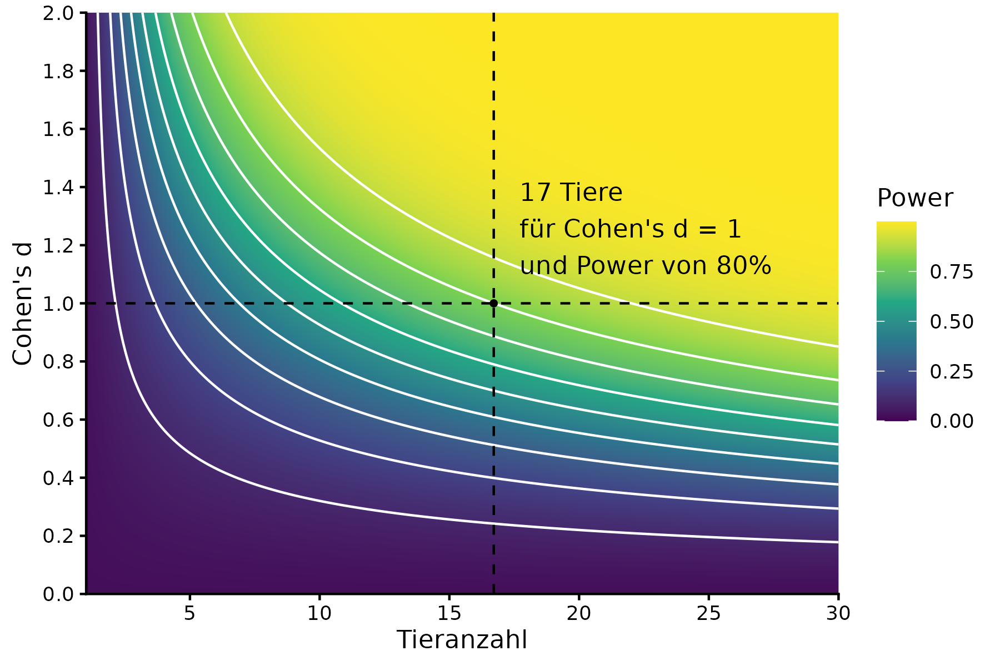

```{r setup, include=FALSE}
knitr::opts_chunk$set(echo = TRUE)
```

Required packages for the power analysis and visualisation.
```{r libraries}
library(ggplot2)
library(data.table)
```

For this experiment we plan with an effect size of Cohen's d = 1. We also will compute for many different combinations to visualise the power as a function of n and the effect size d.
Therefore we will make a grid of n and d.
```{r effect_size}
effect_size_target <- 1

d_grid <- data.table(expand.grid(n = seq(1,30,0.01),
                       d = seq(0.001,2,0.001)))
```

We then compute the power for every combination and add it to our grid. Then we extract the point on the axes where we have $d=1$ and power is 80%.
```{r power_calculation_grid}}
d_grid[, power := power.t.test(n = n, d = d, sig.level = 0.05, power = NULL, alternative = "two.sided")$power]
d_1_point <- d_grid[d==effect_size_target&power>0.8][d_grid[d==effect_size_target&power>0.8, which.min(abs(power-0.8)),]]
``` 

```{r power_plot}
ggplot(d_grid, aes(x=n, y=d, fill=power)) +
  geom_raster() +
  scale_fill_viridis_c(begin = 0, end =1, name="Power") +
  scale_x_continuous(breaks=seq(0,30,5), name="Tieranzahl") +
  scale_y_continuous(breaks=seq(0,2,0.2), name="Cohen's d") +
  coord_cartesian(xlim=c(1,30), ylim=c(0,2), expand = F) +
  geom_contour(aes(z=power), color="white") +
  geom_point(data=d_1_point,
             aes(x=n, y=d), color="black", size=1) +
  geom_vline(xintercept = d_1_point$n, linetype="dashed", color="black") +
  geom_hline(yintercept = d_1_point$d, linetype="dashed", color="black") +
  geom_text(aes(x=n+1, y=d+0.1, label=paste0(ceiling(n), " Tiere\nfür Cohen's d = ",effect_size_target,"\nund Power von 80%")),  
            data=d_1_point, hjust="outward", vjust="outward") +
  theme_classic()
```


```{r save_plot, eval=FALSE}
ggsave("results/power_B1.png", width=6, height=4)
```

We can also directly calculate n for our target effect size and power.
```{r power_calculation_n, eval=TRUE}
power.t.test(d = effect_size_target, sig.level = 0.05, power = 0.8, alternative = "two.sided")
```

```
     Two-sample t test power calculation 

              n = 16.71477
          delta = 1
             sd = 1
      sig.level = 0.05
          power = 0.8
    alternative = two.sided

NOTE: n is number in *each* group
```