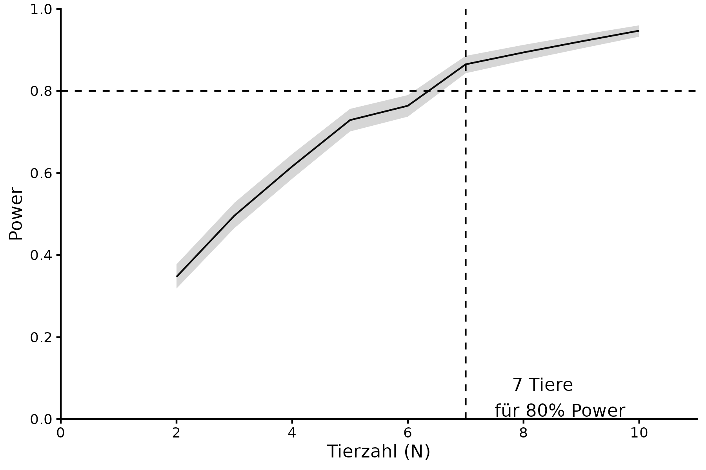

```{r setup, include=FALSE}
knitr::opts_chunk$set(echo = TRUE)
```

Required packages for the power analysis and visualisation.
```{r libraries}
library(lme4)
library(simr)
library(data.table)
library(ggplot2)
```

For this experiment we plan with an effect based on the Poisson distribution. Hence we will use the Incidence Rate Ratio (IRR) as our effect size. We will simulate data based on the expected IRR and then calculate the power for different n. The IRR and baseline lambda are based on Teng et al. 2022. However, we expect a reduction of the IRR by at least 15% when analysing the last 3 sessions.

```{r sim_function}
# design parameters
p_vals <- function(n) {
  print(n)
  rescue_reduction_fraction <- 1-0.0
  rescue_lambda <- 120*rescue_reduction_fraction
  pbs_increase <- 1/rescue_reduction_fraction
  IRR_rescue_proportion <- 0.85 # reduction of IRR of 15%
  IRR <- 1.63
  
  Rescue_lambda <- 120*rescue_reduction_fraction
  PBS_increase <- 1/rescue_reduction_fraction
  sessions <- 3
  design <- expand.grid(
    subject   = rep(factor(1:(2 * n)), times = sessions),
    condition = factor(c("pre", "during"), levels = c("pre", "during"))
  )
  
  # make design table
  set.seed(1) # set seed for reproducibility
  design <- data.table(design,
                       group=factor(c("PBS", "Rescue"), levels=c("Rescue", "PBS")))
  design[,sessions:=rep(rep(1:sessions, each=2*n), times = 2),][
    ,lambda:=log(rescue_lambda),][
      group=="PBS", lambda:=lambda+log(pbs_increase),][
        condition=="during", lambda:=lambda+log(IRR*IRR_rescue_proportion),][
          condition=="during"&group=="PBS", lambda:=lambda-log(IRR_rescue_proportion),]
  design[,count:=rpois(.N, exp(lambda))][,lambda:=NULL]
  
  # define model
  model <- glmer(
    count ~ group * condition + (1 | subject),
    family = poisson,
    data   = design
  )
  
  boxplot(count ~ condition*group, data=design)
  
  # set fixed effects and random effects variance
  fixef(model) <- c(
    "(Intercept)" = log(rescue_lambda),                    # VLP log(baseline rate)
    "groupPBS" = log(pbs_increase),                 # PBS log(baseline rate)
    "conditionduring" = log(IRR*IRR_rescue_proportion),                # VLP log(IRR)
    "groupPBS:conditionduring" = -log(IRR_rescue_proportion) # PBS log(IRR)
  )
  
  # variance of random effect
  VarCorr(model)$subject[1] <- 0.4^2
  
  # compare to alternative model and get p-values
  powerOut <- powerSim(
    model,
    test = fcompare(count ~ group + condition, "lr"),
    nsim = 1000,
  )
  return(data.table(n_animals = n, power = powerOut$pval))
}
```

We apply for every n the function to extract the outcome of our tests. 
```{r power_calculation, eval=FALSE}
n_animals <- c(2:10)
power_summary <- lapply(n_animals, p_vals)
power_dt <- rbindlist(power_summary)[,.(n = sum(power < 0.05)), by=.(n_animals)]
```

Then the power is calculated based on the simulations
```{r power_calculation_summary}
power_dt[,`:=`(Power = n/1000, CI = list(qbeta(c(0.025, 0.5,0.975), shape1 = 1+n, shape2 = 1000-n))), by=.(n_animals)]
power_dt[,`:=`(CI_low = unlist(CI)[1], CI_mid = unlist(CI)[2], CI_high = unlist(CI)[3]), by=.(n_animals)][,CI:=NULL,]
```


```{r power_plot}
ggplot(power_dt, aes(x=n_animals, y=Power)) +
  geom_line()+
  geom_ribbon(aes(ymin=CI_low, ymax=CI_high), alpha=0.2)+
  scale_x_continuous(breaks=seq(0, 12, 2), name = "Tierzahl (N)")+
  scale_y_continuous(breaks=seq(0,1,0.2), limits=c(0,1), name="Power")+
  geom_hline(yintercept = 0.8, linetype="dashed")+
  geom_vline(xintercept = power_dt[CI_low>0.8,min(n_animals),], linetype="dashed")+
  annotate("text", x=power_dt[CI_low>0.8,min(n_animals),]+0.5, y=0.1, label=paste("  ",power_dt[CI_low>0.8,min(n_animals),],  "Tiere\nfür 80% Power"), hjust = "outward", vjust="outward")+
  coord_cartesian(ylim = c(0,1), xlim = c(0,12), expand = F)+
  theme_classic()
```


```{r save_plot, eval=FALSE}
ggsave("results/power_C2.png", width=6, height=4)
```
